# Restaurant Management System - Backend Flow Diagrams

## 1. Overall System Architecture Flow

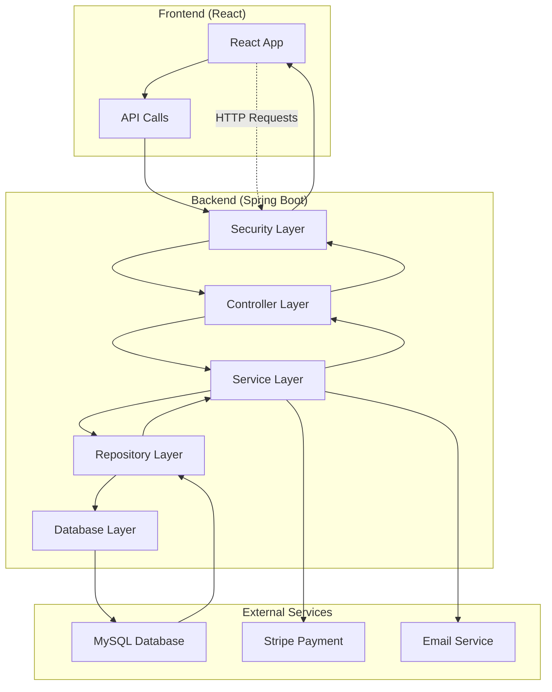

## 2. Authentication & Authorization Flow

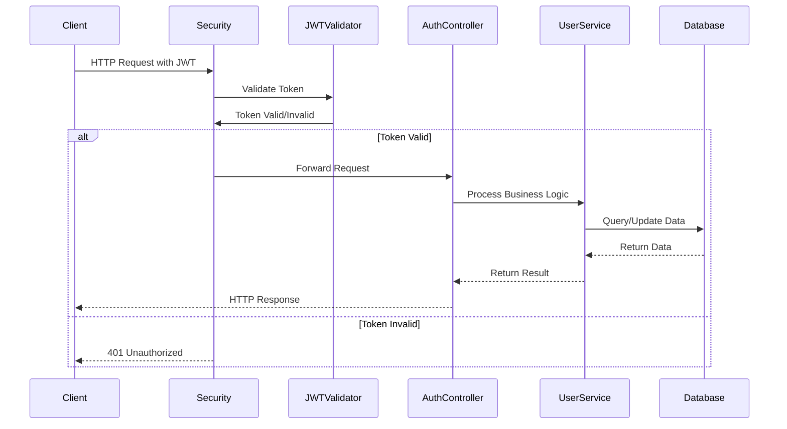

## 3. User Registration Flow

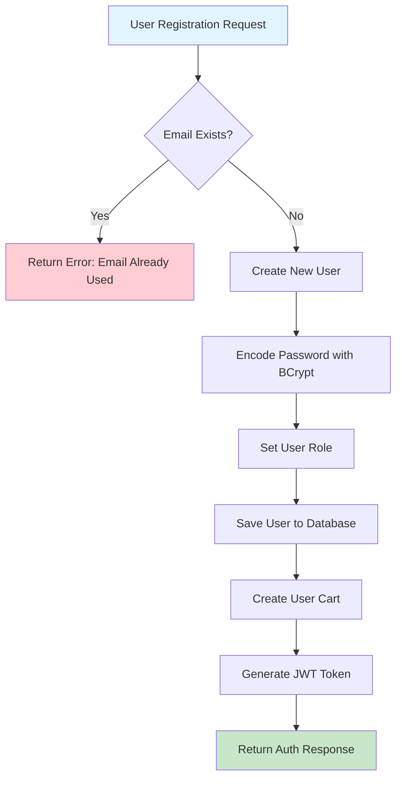

## 4. User Login Flow

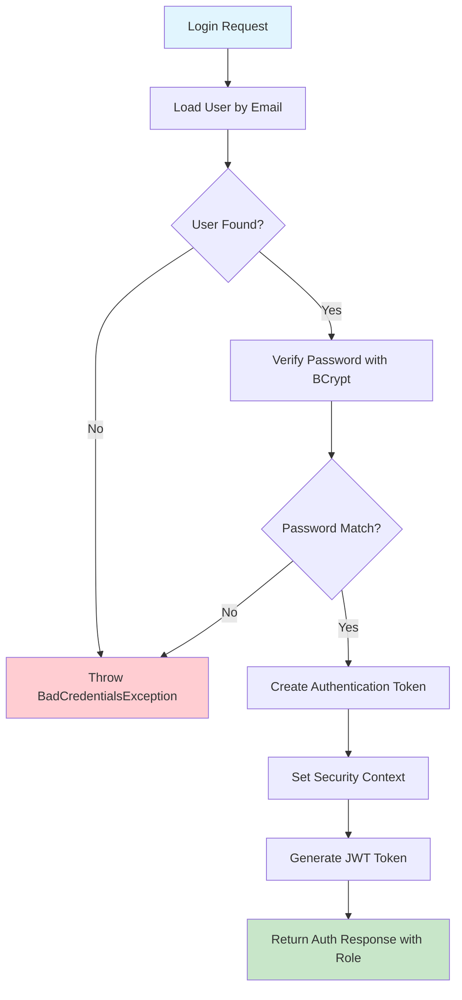

## 5. Restaurant Management Flow

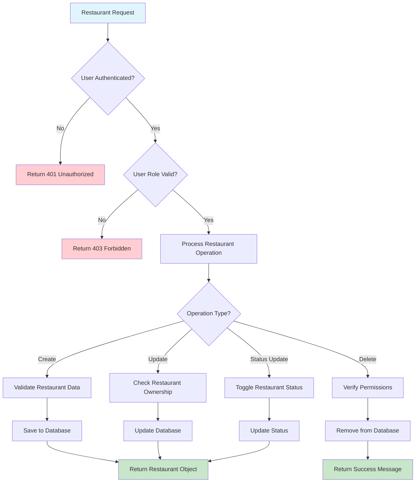

## 6. Food Ordering Flow

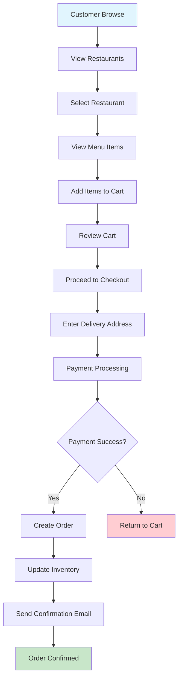

## 7. Cart Management Flow

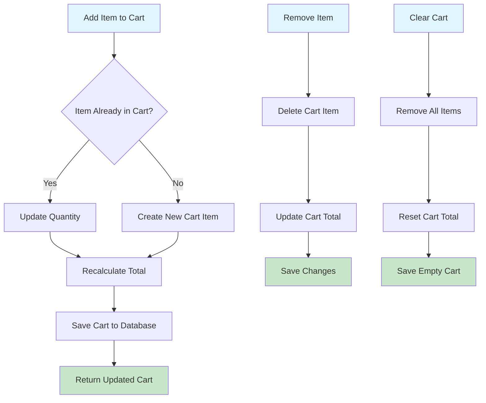

## 8. Order Processing Flow

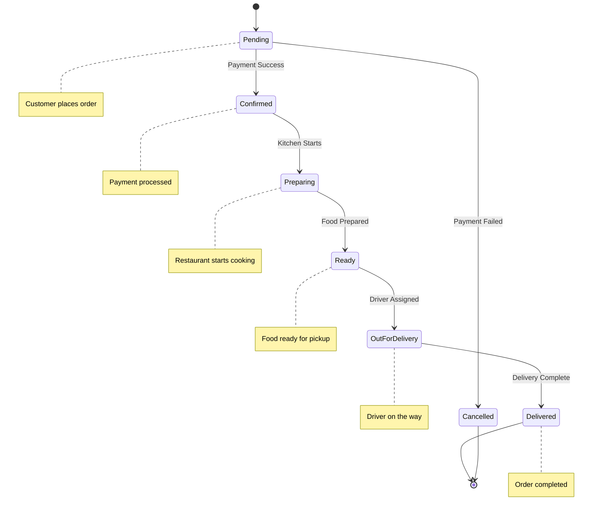

## 9. Payment Integration Flow

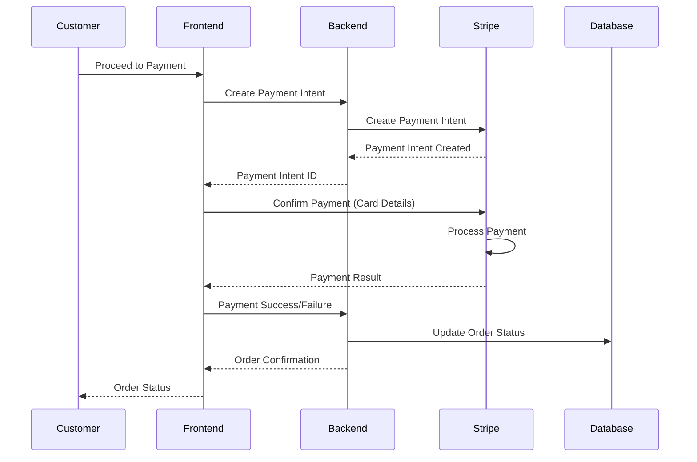

## 10. Exception Handling Flow

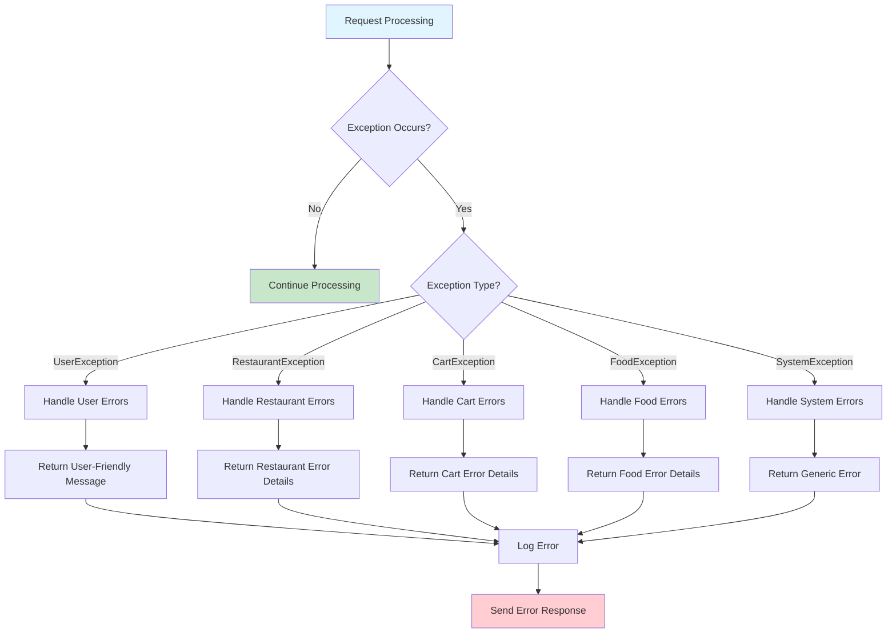

## 11. Database Entity Relationships

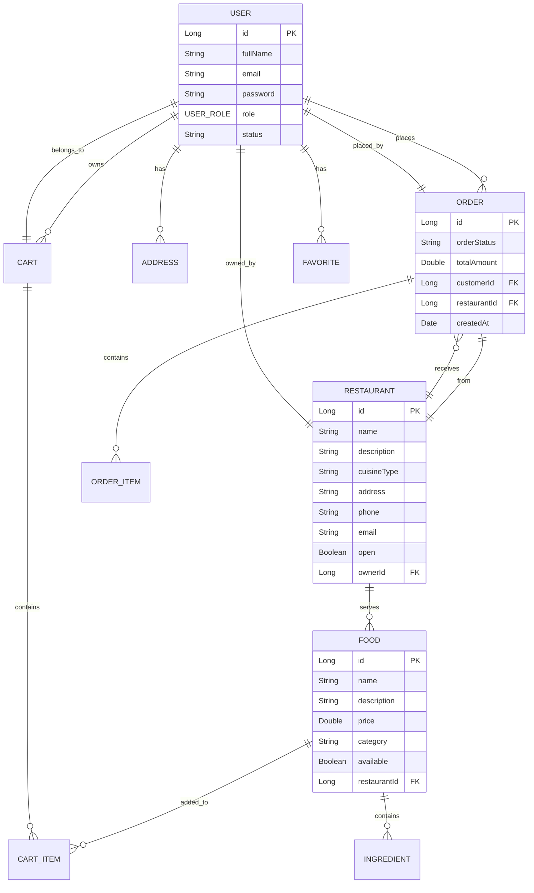

## 12. API Endpoint Structure

```mermaid
graph TD
    A[API Root /api] --> B[Auth /auth]
    A --> C[Customer APIs]
    A --> D[Restaurant APIs]
    A --> E[Admin APIs]
    
    B --> B1[POST /signup]
    B --> B2[POST /signin]
    B --> B3[POST /reset-password]
    B --> B4[POST /reset-password-request]
    
    C --> C1[GET /restaurants]
    C --> C2[GET /restaurants/{id}]
    C --> C3[POST /cart/add]
    C --> C4[GET /cart]
    C --> C5[POST /orders]
    C --> C6[GET /orders]
    
    D --> D1[POST /admin/restaurants]
    D --> D2[PUT /admin/restaurants/{id}]
    D --> D3[DELETE /admin/restaurants/{id}]
    D --> D4[POST /admin/food]
    D --> D5[PUT /admin/food/{id}]
    
    E --> E1[GET /admin/users]
    E --> E2[PUT /admin/users/{id}]
    E --> E3[GET /admin/analytics]
    E --> E4[POST /admin/categories]
    
    style A fill:#e3f2fd
    style B fill:#f3e5f5
    style C fill:#e8f5e8
    style D fill:#fff3e0
    style E fill:#fce4ec
```

## 13. Security Filter Chain

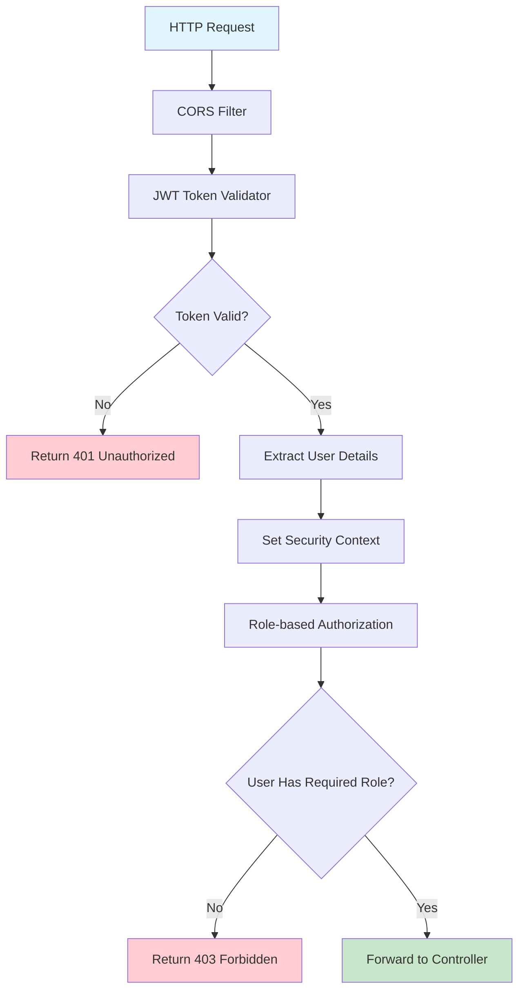

## 14. Service Layer Business Logic Flow

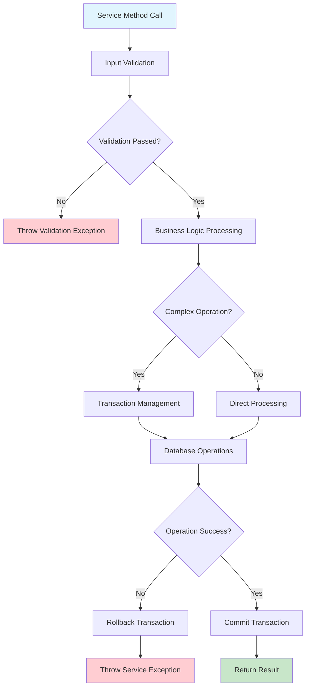

## 15. Data Flow Between Layers

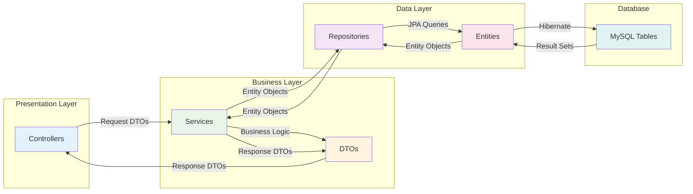

---

## Key Features of the Flow Diagrams:

1. **Color Coding**: 
   - 🟦 Blue: Input/Start points
   - 🟩 Green: Success/Completion points
   - 🟥 Red: Error/Exception points
   - 🟨 Yellow: Processing/Intermediate points

2. **Flow Types**:
   - **Sequence Diagrams**: Show time-based interactions
   - **Flowcharts**: Show decision-based logic
   - **State Diagrams**: Show state transitions
   - **Entity-Relationship**: Show data structure
   - **Graphs**: Show hierarchical relationships

3. **Architecture Patterns**:
   - **Layered Architecture**: Clear separation of concerns
   - **MVC Pattern**: Model-View-Controller separation
   - **Repository Pattern**: Data access abstraction
   - **Service Layer**: Business logic encapsulation
   - **Security Filter Chain**: Authentication & authorization

These diagrams provide a comprehensive understanding of how data flows through the system, how different components interact, and how the overall architecture is structured.

